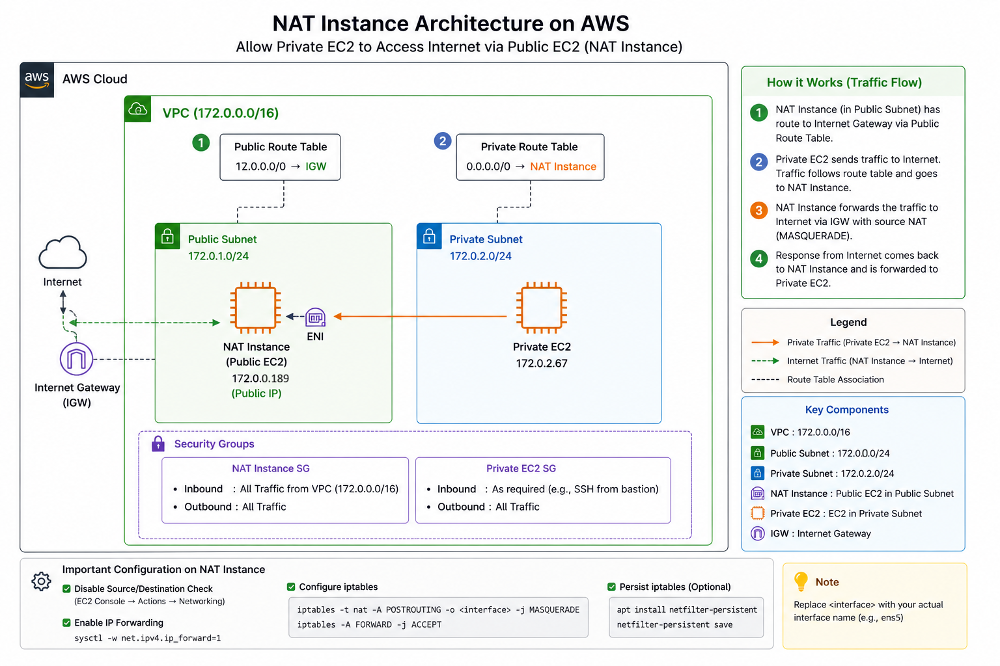
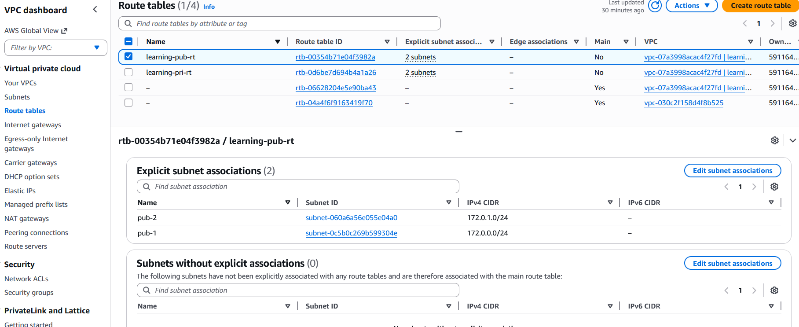
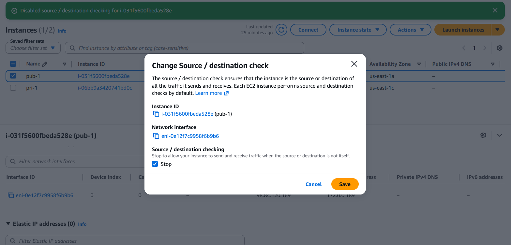
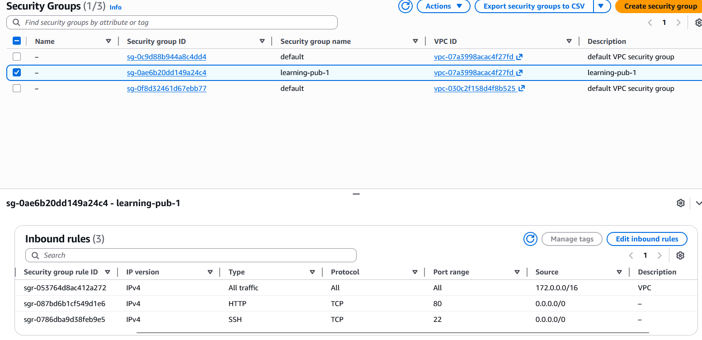
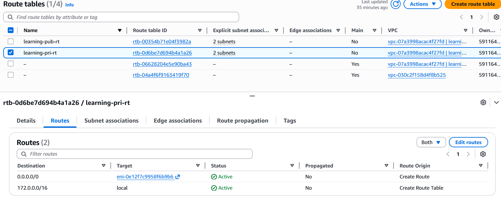
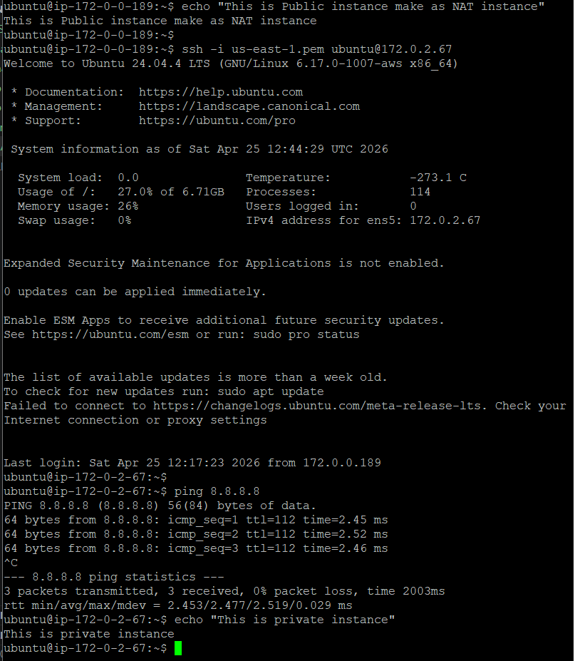

# 🚀 NAT Instance Setup on AWS (Public → Private Internet Access)

This guide walks you through converting a **public EC2 instance into a NAT instance** so your **private EC2** can access the internet.

---

## 📌 Architecture Overview

```
Private EC2  →  NAT Instance (Public EC2)  →  Internet Gateway  →  Internet
```

---

## 🧱 Prerequisites

* VPC created
* 1 Public Subnet
* 1 Private Subnet
* Internet Gateway attached to VPC
* Route tables created:

  * Public Route Table
  * Private Route Table
* 2 EC2 instances:

  * Public EC2 (NAT Instance)
  * Private EC2

---

## 📸 Architecture Diagram



---

# 🟢 Step 1: Configure Public Route Table

* Go to **Route Tables**
* Select **Public Route Table**
* Add route:

```
0.0.0.0/0 → Internet Gateway (IGW)
```

* Associate with **Public Subnet**

📸


---

# 🔵 Step 2: Prepare NAT Instance (Public EC2)

### ✅ Ensure:

* Public IP attached
* In Public Subnet

---

## 🚨 Disable Source/Destination Check

* EC2 → Select instance
* Actions → Networking → Disable Source/Destination Check

📸


---

# ⚙️ Step 3: Enable IP Forwarding

SSH into NAT instance:

```bash
sudo sysctl -w net.ipv4.ip_forward=1
```

Make permanent:

```bash
sudo nano /etc/sysctl.conf
```

Uncomment/add:

```
net.ipv4.ip_forward=1
```

---

# 🔥 Step 4: Configure NAT using iptables

## 🔍 Find correct interface

```bash
ip route | grep default
```

Example output:

```
default via 172.0.1.1 dev ens5
```

👉 Interface = `ens5`

---

## ✅ Apply NAT rule

```bash
sudo iptables -t nat -A POSTROUTING -o ens5 -j MASQUERADE
sudo iptables -A FORWARD -j ACCEPT
```

---

## 💾 Persist rules (optional)

```bash
sudo apt update
sudo apt install netfilter-persistent -y
sudo netfilter-persistent save
```

---


---

# 🔐 Step 5: Security Groups

## NAT Instance SG

**Inbound:**

```
All traffic → VPC CIDR (e.g., 172.0.0.0/16)
```

**Outbound:**

```
Allow all
```

---

📸


---

## Private EC2 SG

**Outbound:**

```
Allow all
```


---

# 🧭 Step 6: Configure Private Route Table

* Go to **Private Route Table**
* Add route:

```
0.0.0.0/0 → Target: Instance (NAT EC2)
```

👉 AWS internally shows this as **ENI**

---

📸


---

# 🔗 Step 7: Associate Subnets

Ensure:

| Subnet         | Route Table |
| -------------- | ----------- |
| Public Subnet  | Public RT   |
| Private Subnet | Private RT  |


---

# 🧪 Step 8: Testing

SSH into **Private EC2**:

```bash
ping 8.8.8.8
```

```bash
curl http://google.com
```

```bash
sudo apt update
```

---

## ✅ Expected Result

* Internet works from private EC2
* Packages download successfully

---

# 🔍 Debugging Guide

## ❌ No Internet?

### 1. Check Route

```bash
ip route
```

Expected:

```
default via <NAT private IP>
```

---

### 2. Check IP Forwarding

```bash
cat /proc/sys/net/ipv4/ip_forward
```

Must be:

```
1
```

---

### 3. Check iptables

```bash
sudo iptables -t nat -L -n -v
```

Must show:

```
MASQUERADE
```

---

### 4. Check Interface

```bash
ip route | grep default
```

---

### 5. Check Source/Dest Check

Must be **Disabled**

---

# ⚠️ Common Mistakes

* Using `eth0` instead of `ens5`
* Forgetting source/dest check
* Route table pointing to IGW instead of instance
* NAT instance in private subnet
* Missing iptables rules

---

# 💡 Pro Tips

* Use **user-data script** for automation:

```bash
#!/bin/bash
sysctl -w net.ipv4.ip_forward=1
IFACE=$(ip route | grep default | awk '{print $5}')
iptables -t nat -A POSTROUTING -o $IFACE -j MASQUERADE
iptables -A FORWARD -j ACCEPT
```

---

# 🎯 Final Result

✔ Private EC2 has internet access
✔ No public exposure
✔ Cost-effective alternative to NAT Gateway

---
📸


---

# 🏁 Done!

You’ve successfully built a **custom NAT instance setup** 🎉

---
