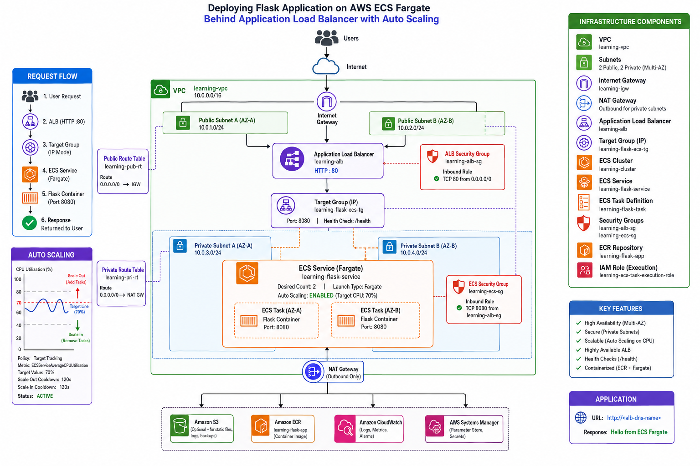
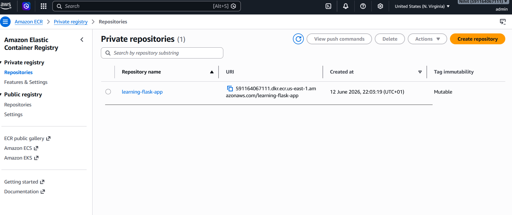
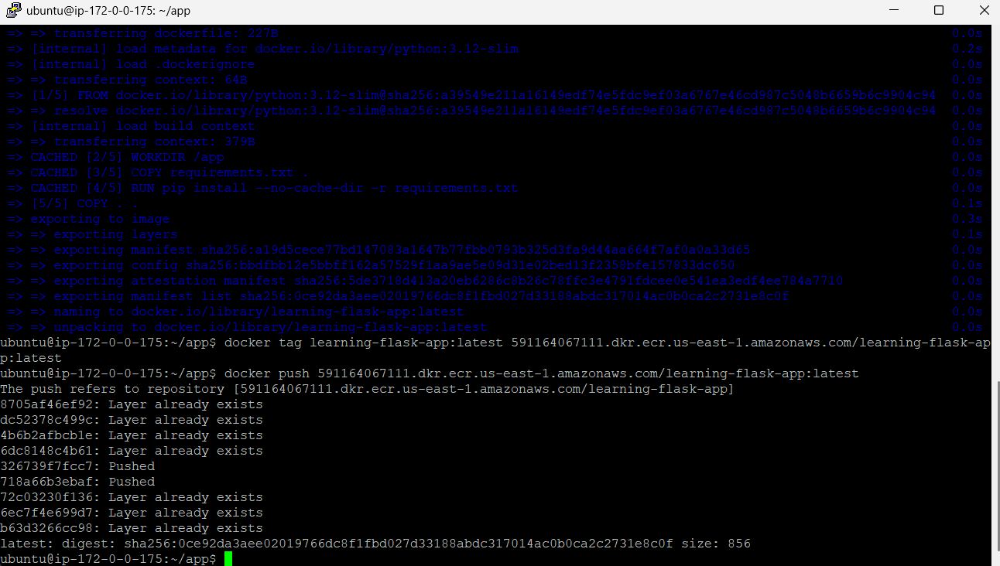
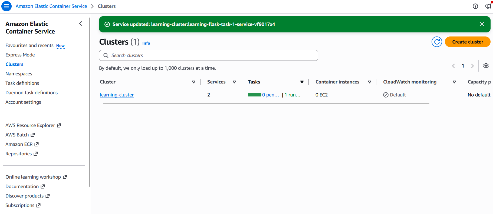
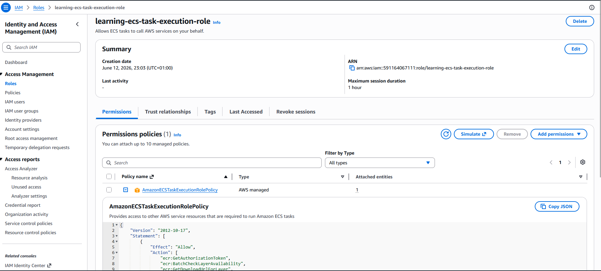
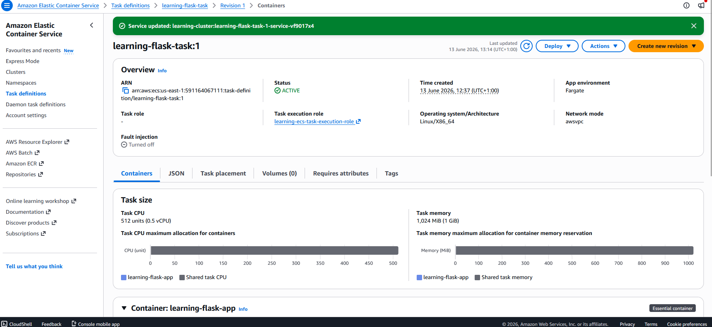
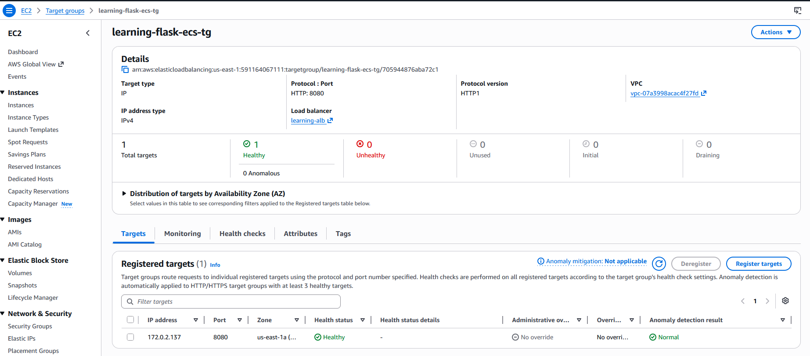
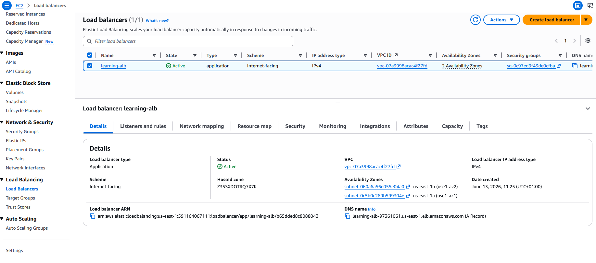
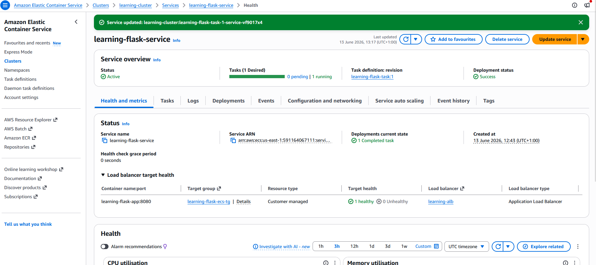
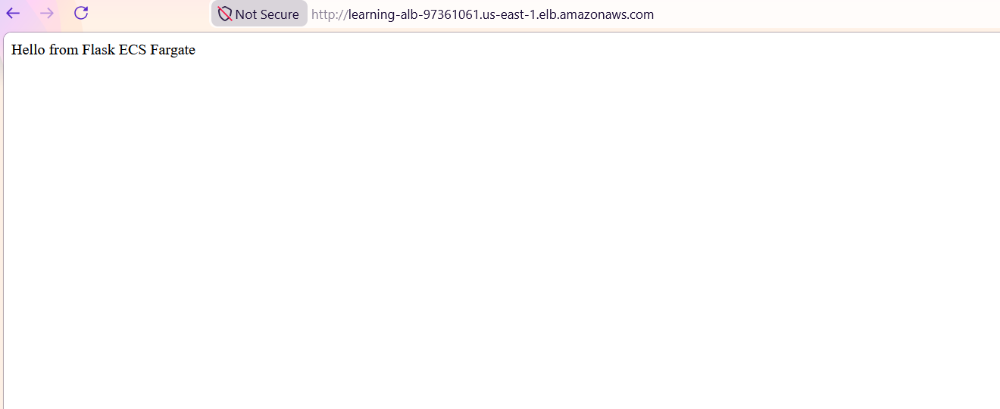

---

# 🚀 Deploying a Flask Application on AWS ECS Fargate Behind an Application Load Balancer

This guide walks through deploying a containerized Python Flask application on AWS ECS Fargate running in private subnets and exposing it securely through an AWS Application Load Balancer (ALB). It also includes **Auto Scaling based on CPU utilization** to ensure high availability and performance under load.

---

# 📌 Architecture Overview

```text
                    ┌──────────────────────────┐
                    │        Internet          │
                    └────────────┬─────────────┘
                                 │
                                 ▼
                    ┌──────────────────────────┐
                    │ Application Load Balancer│
                    │     (Public Subnets)     │
                    └────────────┬─────────────┘
                                 │
                                 ▼
                    ┌──────────────────────────┐
                    │   Target Group (IP)      │
                    └────────────┬─────────────┘
                                 │
             ┌───────────────────┴───────────────────┐
             ▼                                       ▼
     ECS Task (Fargate)                      ECS Task (Fargate)
     Private Subnet AZ-A                     Private Subnet AZ-B
     Flask Container (:8080)                 Flask Container (:8080)
```

---

# 📸 Architecture Diagram



---

# 📸 Request Flow Diagram

```text
User Request
     │
     ▼
ALB (HTTP :80)
     │
     ▼
Target Group (IP Mode)
     │
     ▼
ECS Service (Fargate)
     │
     ▼
Flask Container (Port 8080)
     │
     ▼
Response returned to user
```

---

# 📸 VPC Overview


---

# 📸 ECS Architecture


---

# 🏗 Infrastructure Components

| Resource Type       | Name                   |
| ------------------- | ---------------------- |
| VPC                 | learning-vpc           |
| Public Subnet A     | pub-1                  |
| Public Subnet B     | pub-2                  |
| Private Subnet A    | pri-1                  |
| Private Subnet B    | pri-2                  |
| Public Route Table  | learning-pub-rt        |
| Private Route Table | learning-pri-rt        |
| ALB Security Group  | learning-alb-sg        |
| ECS Security Group  | learning-ecs-sg        |
| ALB                 | learning-alb           |
| Target Group        | learning-flask-ecs-tg  |
| ECS Cluster         | learning-cluster       |
| ECS Service         | learning-flask-service |
| ECS Task Definition | learning-flask-task    |
| ECR Repository      | learning-flask-app     |

---

# 🟢 Step 1: Verify Network Architecture

Ensure the following resources already exist:

* VPC
* Public Subnets
* Private Subnets
* Internet Gateway
* NAT Gateway
* Route Tables

---

# 📸 VPC Components


---

# 🟢 Step 2: Create ECR Repository

Navigate:

```text
Amazon ECR → Repositories → Create Repository
```

Repository Name:

```text
learning-flask-app
```

---

# 📸 ECR Repository



---

# 🟢 Step 3: Create Flask Application

Project Structure:

```text
app/
├── app.py
├── requirements.txt
├── Dockerfile
└── .dockerignore
```

---

## app.py

```python
from flask import Flask

app = Flask(__name__)

@app.route("/")
def home():
    return "Hello from ECS Fargate"

@app.route("/health")
def health():
    return "OK", 200
```

---

## requirements.txt

```text
flask
gunicorn
```

---

## Dockerfile

```dockerfile
FROM python:3.12-slim

WORKDIR /app

COPY requirements.txt .

RUN pip install --no-cache-dir -r requirements.txt

COPY . .

EXPOSE 8080

CMD ["gunicorn","--bind","0.0.0.0:8080","app:app"]
```

---

## .dockerignore

```text
venv/
.git/
__pycache__/
```

---

# 🟢 Step 4: Build Docker Image

```bash
docker build -t learning-flask-app .
```

Verify:

```bash
docker images
```

---

# 📸 Docker Build


---

# 🟢 Step 5: Push Image to ECR

Authenticate:

```bash
aws ecr get-login-password \
--region us-east-1 \
| docker login \
--username AWS \
--password-stdin ACCOUNT_ID.dkr.ecr.us-east-1.amazonaws.com
```

Tag:

```bash
docker tag learning-flask-app:latest \
ACCOUNT_ID.dkr.ecr.us-east-1.amazonaws.com/learning-flask-app:latest
```

Push:

```bash
docker push \
ACCOUNT_ID.dkr.ecr.us-east-1.amazonaws.com/learning-flask-app:latest
```

---

# 📸 Image Push



---

# 🟢 Step 6: Create ECS Cluster

Cluster Name:

```text
learning-cluster
```

Infrastructure:

```text
AWS Fargate
```

---

# 📸 ECS Cluster



---

# 🟢 Step 7: Create ECS Task Execution Role

Role Name:

```text
learning-ecs-task-execution-role
```

Policy:

```text
AmazonECSTaskExecutionRolePolicy
```

---

# 📸 IAM Role



---

# 🟢 Step 8: Create ECS Task Definition

| Setting        | Value                            |
| -------------- | -------------------------------- |
| Family         | learning-flask-task              |
| CPU            | 512                              |
| Memory         | 1024                             |
| Execution Role | learning-ecs-task-execution-role |

Container:

| Setting | Value              |
| ------- | ------------------ |
| Name    | learning-flask-app |
| Port    | 8080               |

---

# 📸 Task Definition



---

# 🟢 Step 9: Create ECS Security Group

Inbound Rule:

| Type | Port | Source          |
| ---- | ---- | --------------- |
| TCP  | 8080 | learning-alb-sg |

---

# 📸 ECS Security Group


---

# 🟢 Step 10: Create Target Group

| Setting | Value   |
| ------- | ------- |
| Type    | IP      |
| Port    | 8080    |
| Path    | /health |

Name:

```text
learning-flask-ecs-tg
```

---

# 📸 Target Group



---

# 🟢 Step 11: Create Application Load Balancer

| Setting | Value        |
| ------- | ------------ |
| Name    | learning-alb |
| Subnets | pub-1, pub-2 |

Listener:

```text
HTTP : 80
```

---

# 📸 ALB Configuration



---

# 🟢 Step 12: Create ECS Service

| Setting       | Value                  |
| ------------- | ---------------------- |
| Service Name  | learning-flask-service |
| Desired Count | 2                      |
| Launch Type   | Fargate                |

Networking:

| Setting   | Value        |
| --------- | ------------ |
| Subnets   | pri-1, pri-2 |
| Public IP | Disabled     |

---

# 📸 ECS Service



---

# 🟢 Step 13: Verify Running Tasks

Expected:

* 2 tasks running
* One in each AZ

---

# 📸 Running Tasks


---

# 🟢 Step 14: Verify Target Health

Expected:

```text
Healthy
Healthy
```

---

# 📸 Target Health


---

# 🟢 Step 15: Verify Application

Open:

```text
http://<alb-dns-name>
```

Expected:

```text
Hello from ECS Fargate
```

---

# 📸 Application Test



---

# ⚖️ Auto Scaling (NEW)

ECS Service Auto Scaling is enabled using **Target Tracking Policy**.

---

## Scaling Configuration

| Setting            | Value                           |
| ------------------ | ------------------------------- |
| Resource           | learning-flask-service          |
| Policy Type        | Target Tracking                 |
| Metric             | ECSServiceAverageCPUUtilization |
| Target Value       | 70%                             |
| Scale In Cooldown  | 120s                            |
| Scale Out Cooldown | 120s                            |
| Status             | Active                          |

---

## 📈 Scaling Behavior

```text
CPU > 70%  → Scale Out (Add Tasks)
CPU < 70%  → Scale In (Remove Tasks)
```

---

# 📸 Scaling Architecture

```text
                CPU Utilization

      100% ────────────────────────
       80% ───── Scale Out ▲
       70% ───── Target Line ──────
       60% ───── Scale In  ▼
       40% ────────────────────────
```

---

# 🎯 Final Architecture (Production View)

```text
Internet
   │
   ▼
ALB (Public Subnets)
   │
   ▼
Target Group (IP)
   │
   ▼
ECS Service (Auto Scaling Enabled)
   │
   ▼
Fargate Tasks (Multi AZ)
```

---

# 📸 Architecture Diagram

```text

                                ┌────────────────────────────┐
                                │          Internet          │
                                └─────────────┬──────────────┘
                                              │
                                              ▼
                                ┌────────────────────────────┐
                                │   Internet Gateway (IGW)   │
                                └─────────────┬──────────────┘
                                              │
                                              ▼
                   ┌────────────────────────────────────────────┐
                   │     Application Load Balancer (ALB)        │
                   │        Public Subnets (AZ-A, AZ-B)         │
                   │  - Listens on HTTP :80                     │
                   └───────────────┬────────────────────────────┘
                                   │
                                   ▼
                   ┌────────────────────────────────────────────┐
                   │              Target Group                  │
                   │           (IP-based routing)               │
                   │     Health Check: /health (HTTP 200)      │
                   └───────────────┬────────────────────────────┘
                                   │
                                   ▼
        ┌────────────────────────────────────────────────────────────┐
        │                  ECS Service (Fargate)                     │
        │        Desired Count: 2 (Auto Scaling Enabled)            │
        │        Private Subnets (Multi-AZ: pri-1, pri-2)           │
        └───────────────┬────────────────────────────┬──────────────┘
                        │                            │
                        ▼                            ▼
        ┌──────────────────────────┐   ┌──────────────────────────┐
        │  ECS Task (AZ-A)         │   │  ECS Task (AZ-B)         │
        │  Flask Container         │   │  Flask Container         │
        │  Port: 8080              │   │  Port: 8080              │
        └──────────────┬───────────┘   └──────────────┬───────────┘
                       │                              │
                       └──────────────┬───────────────┘
                                      ▼
                        ┌──────────────────────────┐
                        │   NAT Gateway (Outbound) │
                        │  (for ECR / updates)     │
                        └──────────────────────────┘


──────────────────────────────────────────────────────────────────────
                         ⚡ AUTO SCALING LAYER
──────────────────────────────────────────────────────────────────────

                    ECS Service Auto Scaling Policy

        Metric: ECSServiceAverageCPUUtilization
        Target: 70%

        ┌──────────────────────────────────────────────┐
        │ CPU > 70%  → Scale OUT (Add new tasks)      │
        │ CPU < 70%  → Scale IN (Remove tasks)        │
        └──────────────────────────────────────────────┘

        Cooldowns:
        - Scale Out: 120s
        - Scale In : 120s
        - Status   : ACTIVE
```


# 🚀 Future Enhancements

* HTTPS via ACM
* Route53 custom domain
* CloudWatch dashboards
* WAF integration
* Blue/Green deployments
* GitLab CI/CD pipeline
* X-Ray tracing

---

# 🏁 Summary

This setup provides a **production-ready, highly available, and auto-scaled Flask application** using:

* AWS ECS Fargate
* Application Load Balancer
* Private subnet deployment
* Target Tracking Auto Scaling (CPU-based)
* Multi-AZ resilience

---

