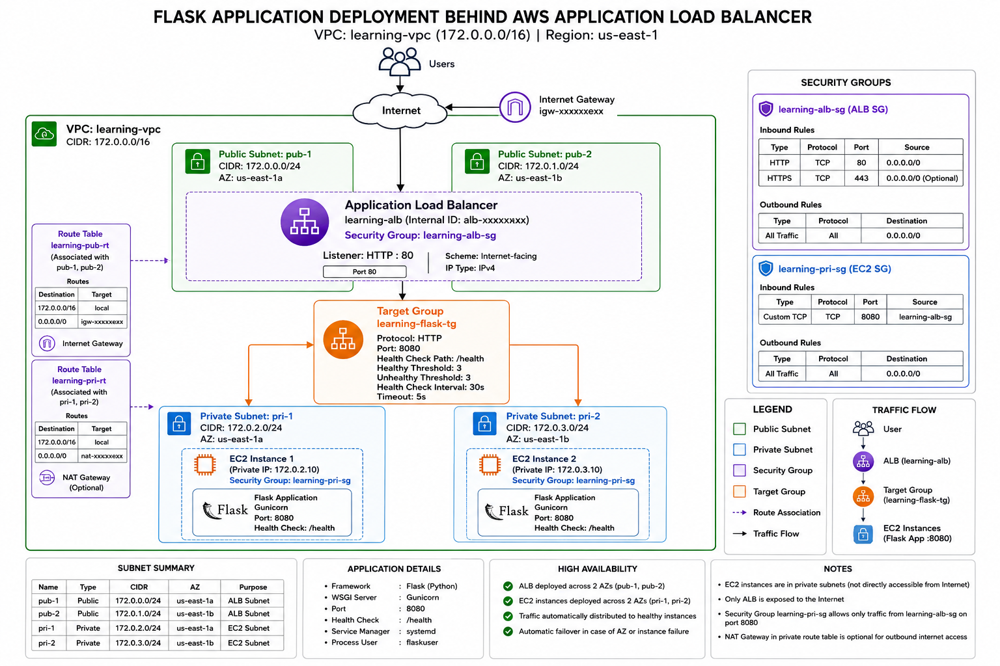
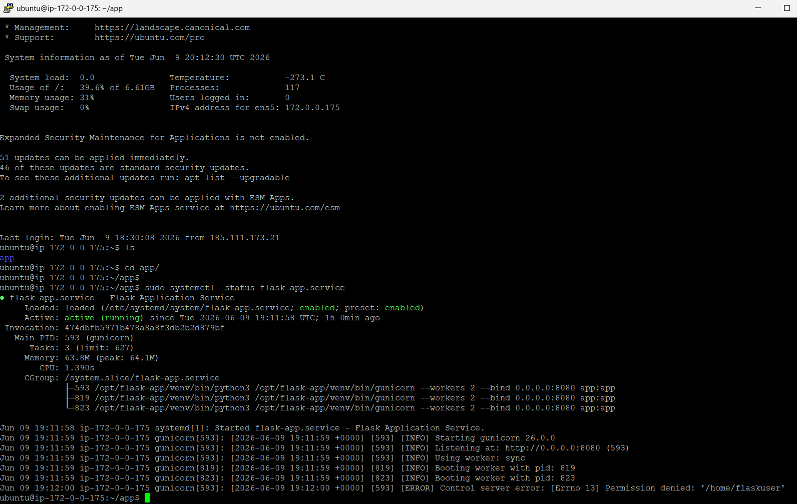
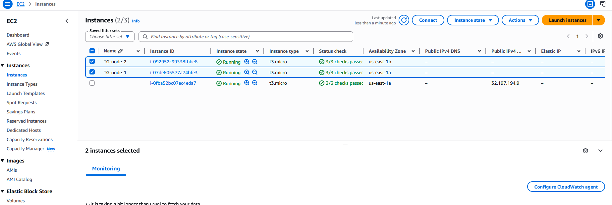
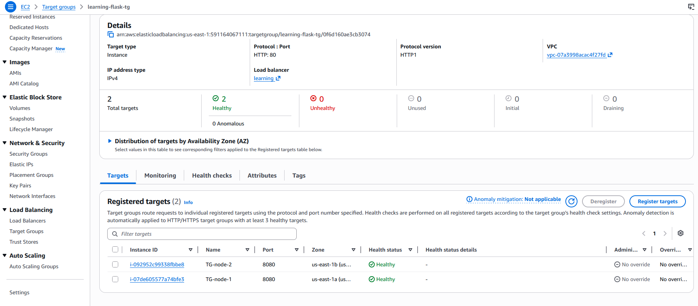
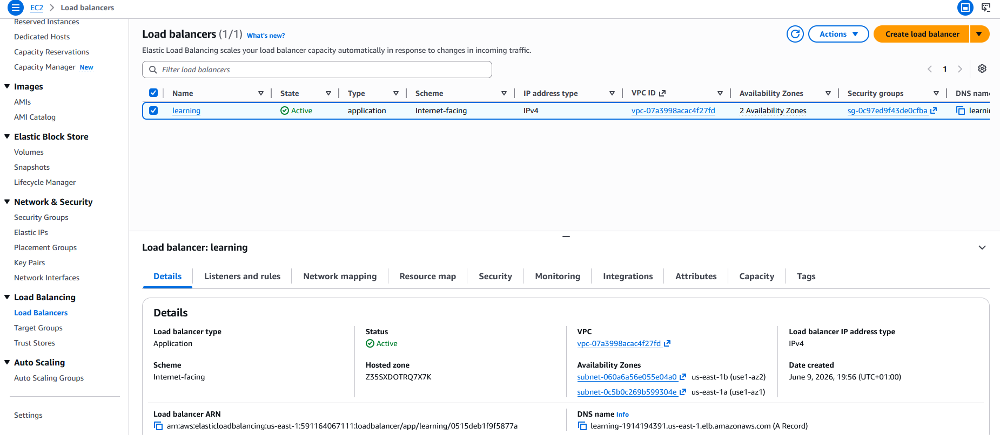
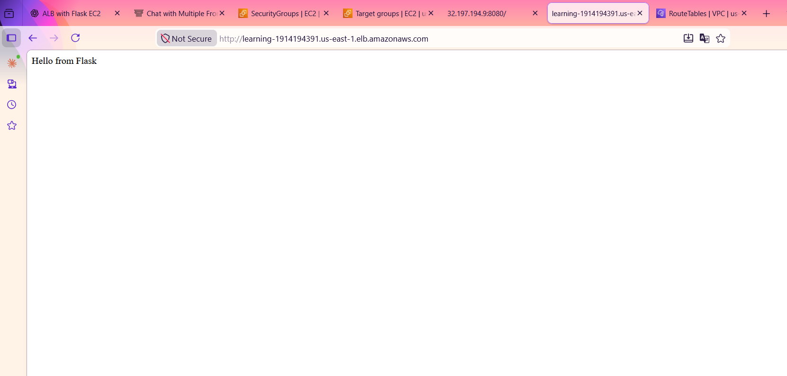

Here's a complete `README.md` you can place in your repository documenting the entire setup from VPC → ALB → Private EC2 → Flask Application → Systemd Service.

# 🚀 Flask Application Deployment Behind AWS Application Load Balancer (ALB)

This guide walks through deploying a Python Flask application on EC2 instances located in private subnets and exposing it securely through an AWS Application Load Balancer (ALB).

---

# 📌 Architecture Overview

```text
                        Internet
                            │
                            ▼
                 Application Load Balancer
                      (Public Subnets)
                            │
            ┌───────────────┴───────────────┐
            │                               │
            ▼                               ▼
      EC2 Instance 1                  EC2 Instance 2
      Private Subnet                  Private Subnet
       us-east-1a                      us-east-1b
       Port 8080                       Port 8080
            │                               │
            └───────────────┬───────────────┘
                            ▼
                    Flask Application
```

---

# 📸 Architecture Diagram



---

# 🏗 Infrastructure Components

## VPC

| Resource | Value                 |
| -------- | --------------------- |
| VPC Name | learning-vpc          |
| VPC ID   | vpc-07a3998acac4f27fd |

---

## Public Subnets

| Name  | CIDR         | AZ         |
| ----- | ------------ | ---------- |
| pub-1 | 172.0.0.0/24 | us-east-1a |
| pub-2 | 172.0.1.0/24 | us-east-1b |

These subnets host the Application Load Balancer.

---

## Private Subnets

| Name  | CIDR         | AZ         |
| ----- | ------------ | ---------- |
| pri-1 | 172.0.2.0/24 | us-east-1a |
| pri-2 | 172.0.3.0/24 | us-east-1b |

These subnets host the Flask EC2 instances.

---

# 🟢 Step 1: Verify Route Tables

## Public Route Table

Route Table:

```text
learning-pub-rt
```

Routes:

| Destination | Target           |
| ----------- | ---------------- |
| VPC CIDR    | local            |
| 0.0.0.0/0   | Internet Gateway |

---

## Private Route Table

Route Table:

```text
learning-pri-rt
```

Routes:

| Destination | Target                 |
| ----------- | ---------------------- |
| VPC CIDR    | local                  |
| 0.0.0.0/0   | NAT Gateway (Optional) |

> NAT Gateway is required only if private EC2 instances need outbound internet access for package installation, updates, Docker image pulls, etc.

---

# 🟢 Step 2: Create Security Groups

---

## ALB Security Group

Security Group:

```text
learning-alb-sg
```

### Inbound Rules

| Protocol | Port | Source               |
| -------- | ---- | -------------------- |
| HTTP     | 80   | 0.0.0.0/0            |
| HTTPS    | 443  | 0.0.0.0/0 (Optional) |

### Outbound Rules

| Protocol    | Destination |
| ----------- | ----------- |
| All Traffic | 0.0.0.0/0   |

---

## Flask Application Security Group

Security Group:

```text
learning-pri-sg
```

### Inbound Rules

| Protocol | Port | Source |
| -------- | ---- | ------ |
| TCP      | 8080 | learning-alb-sg |

### Outbound Rules

| Protocol    | Destination |
| ----------- | ----------- |
| All Traffic | 0.0.0.0/0   |

> Never expose port 8080 directly to the internet.

---

# 🟢 Step 3: Launch EC2 Instances

Launch two EC2 instances.

---

## EC2 Instance 1

| Property       | Value        |
| -------------- | ------------ |
| Subnet         | pri-1        |
| AZ             | us-east-1a   |
| Security Group | learning-pri-sg |

---

## EC2 Instance 2

| Property       | Value        |
| -------------- | ------------ |
| Subnet         | pri-2        |
| AZ             | us-east-1b   |
| Security Group | learning-pri-sg |

---

# 🟢 Step 4: Install Python Dependencies

Update system packages:

```bash
sudo apt update -y
```

Install Python and virtual environment:

```bash
sudo apt install python3 python3-pip python3-venv -y
```

---

# 🟢 Step 5: Create Flask Application

Project structure:

```text
app/
├── app.py
├── requirements.txt
└── venv/
```

---

## Sample Flask Application

Create:

```bash
vi app.py
```

Content:

```python
from flask import Flask

app = Flask(__name__)

@app.route("/")
def home():
    return "Hello from Flask"

@app.route("/health")
def health():
    return "OK", 200
```

---

## Create Requirements File

```text
flask
gunicorn
```

---

# 🟢 Step 6: Create Virtual Environment

Navigate to application directory:

```bash
cd app
```

Create virtual environment:

```bash
python3 -m venv venv
```

Activate virtual environment:

```bash
source venv/bin/activate
```

Install dependencies:

```bash
pip install -r requirements.txt
```

---

# 🟢 Step 7: Test Flask Application



Start Gunicorn manually:

```bash
gunicorn --workers 2 --bind 0.0.0.0:8080 app:app
```

Verify:

```bash
curl localhost:8080
```

Expected output:

```text
Hello from Flask
```

Verify health endpoint:

```bash
curl localhost:8080/health
```

Expected output:

```text
OK
```

---

# 🟢 Step 8: Create Target Group



Navigate:

```text
EC2 → Target Groups → Create Target Group
```

Configuration:

| Property    | Value        |
| ----------- | ------------ |
| Target Type | Instances    |
| Protocol    | HTTP         |
| Port        | 8080         |
| VPC         | learning-vpc |

Name:

```text
learning-flask-tg
```

---

## Health Check Configuration

| Setting  | Value   |
| -------- | ------- |
| Protocol | HTTP    |
| Path     | /health |

---

## Register Targets



Add:

```text
EC2 Instance 1
EC2 Instance 2
```

Port:

```text
8080
```

---

# 🟢 Step 9: Create Application Load Balancer



Navigate:

```text
EC2 → Load Balancers → Create Load Balancer
```

Choose:

```text
Application Load Balancer
```

---

## Basic Configuration

| Property | Value           |
| -------- | --------------- |
| Scheme   | Internet-facing |
| IP Type  | IPv4            |
| VPC      | learning-vpc    |

---

## Select Subnets

Choose:

```text
pub-1
pub-2
```

---

## Security Group

Attach:

```text
learning-alb-sg
```

---

## Listener

| Protocol | Port |
| -------- | ---- |
| HTTP     | 80   |

Default Action:

```text
Forward to learning-flask-tg
```

---

# 🟢 Step 10: Verify Target Health

Navigate:

```text
Target Groups → learning-flask-tg → Targets
```

Expected:

```text
Healthy
Healthy
```

---

# 🟢 Step 11: Configure Systemd Service

Create dedicated user:

```bash
sudo useradd -r -s /bin/false flaskuser
```

---

## Application Directory

Move application:

```bash
sudo mkdir -p /opt/flask-app
```

Copy files:

```bash
sudo cp -r app/* /opt/flask-app/
```

Set ownership:

```bash
sudo chown -R flaskuser:flaskuser /opt/flask-app
```

---

## Create Systemd Service

Create file:

```bash
sudo vi /etc/systemd/system/flask-app.service
```

Content:

```ini
[Unit]
Description=Flask Application Service
After=network.target

[Service]
User=flaskuser
Group=flaskuser

WorkingDirectory=/opt/flask-app

Environment="PATH=/opt/flask-app/venv/bin"

ExecStart=/opt/flask-app/venv/bin/gunicorn \
          --workers 2 \
          --bind 0.0.0.0:8080 \
          app:app

Restart=always
RestartSec=5

[Install]
WantedBy=multi-user.target
```

---

# 🟢 Step 12: Enable Service

Reload systemd:

```bash
sudo systemctl daemon-reload
```

Enable service:

```bash
sudo systemctl enable flask-app
```

Start service:

```bash
sudo systemctl start flask-app
```

---

# 🟢 Step 13: Verify Service

Check status:

```bash
sudo systemctl status flask-app
```

Verify listener:

```bash
sudo ss -tulpn | grep 8080
```

---

## View Logs

Live logs:

```bash
sudo journalctl -u flask-app -f
```

Recent logs:

```bash
sudo journalctl -u flask-app -n 100
```

---

# 🟢 Step 14: Test ALB Endpoint



Retrieve ALB DNS name:

```text
EC2 → Load Balancers → DNS Name
```

Open in browser:

```text
http://<alb-dns-name>
```

Expected:

```text
Hello from Flask
```

---

# 🎯 Final Architecture

```text
Internet
    │
    ▼
Application Load Balancer
(Public Subnets)
    │
    ▼
Target Group (Port 8080)
    │
 ┌──┴─────────────┐
 ▼                ▼
EC2-1           EC2-2
Private         Private
Subnet          Subnet
    │               │
Flask App      Flask App
Port 8080      Port 8080
```

---

Use the following updated architecture section in your `README.md`.

---

# 📸 Architecture Diagram

```text
                                        INTERNET
                                            │
                                            │
                                            ▼
                            ┌───────────────────────────┐
                            │      Internet Gateway     │
                            └─────────────┬─────────────┘
                                          │
                                          ▼
┌─────────────────────────────────────────────────────────────────────────┐
│                           VPC: learning-vpc                            │
│                         CIDR: 172.0.0.0/16                             │
│                                                                         │
│                                                                         │
│  ┌──────────────────────── Public Subnets ─────────────────────────┐    │
│  │                                                                │    │
│  │  pub-1 (172.0.0.0/24)         pub-2 (172.0.1.0/24)            │    │
│  │  us-east-1a                   us-east-1b                      │    │
│  │                                                                │    │
│  │        ┌──────────────────────────────────────────────┐         │    │
│  │        │        Application Load Balancer            │         │    │
│  │        │                                              │         │    │
│  │        │ Security Group: learning-alb-sg             │         │    │
│  │        │ Listener: HTTP/80                           │         │    │
│  │        └─────────────────┬────────────────────────────┘         │    │
│  └──────────────────────────┼────────────────────────────────────┘    │
│                             │                                          │
│                             ▼                                          │
│                ┌─────────────────────────────┐                         │
│                │ Target Group                │                         │
│                │ learning-flask-tg           │                         │
│                │ Protocol: HTTP              │                         │
│                │ Port: 8080                  │                         │
│                │ Health Check: /health       │                         │
│                └──────────────┬──────────────┘                         │
│                               │                                        │
│               ┌───────────────┴───────────────┐                        │
│               │                               │                        │
│               ▼                               ▼                        │
│  ┌─────────────────────┐       ┌─────────────────────┐                 │
│  │      EC2-01         │       │      EC2-02         │                 │
│  │                     │       │                     │                 │
│  │ Subnet: pri-1       │       │ Subnet: pri-2       │                 │
│  │ 172.0.2.0/24        │       │ 172.0.3.0/24        │                 │
│  │ us-east-1a          │       │ us-east-1b          │                 │
│  │                     │       │                     │                 │
│  │ SG: learning-pri-sg │       │ SG: learning-pri-sg │                 │
│  │                     │       │                     │                 │
│  │ Flask + Gunicorn    │       │ Flask + Gunicorn    │                 │
│  │ Port: 8080          │       │ Port: 8080          │                 │
│  │ /health endpoint    │       │ /health endpoint    │                 │
│  └─────────────────────┘       └─────────────────────┘                 │
│                                                                         │
└─────────────────────────────────────────────────────────────────────────┘
```

---

# 🏗 Final Traffic Flow

```text
User Request
     │
     ▼
Application Load Balancer
(learning-alb-sg)
     │
     ▼
Target Group
(learning-flask-tg)
     │
     ├────────► EC2-01 (pri-1)
     │            Flask App :8080
     │
     └────────► EC2-02 (pri-2)
                  Flask App :8080
```

---

# 🔐 Security Flow

```text
Internet
    │
    ▼
learning-alb-sg
    │
    │ Allow HTTP:80 from 0.0.0.0/0
    ▼
Application Load Balancer
    │
    │ Forward traffic
    ▼
learning-pri-sg
    │
    │ Allow TCP:8080 ONLY from learning-alb-sg
    ▼
Private EC2 Instances
```

---

# 📋 Resource Summary

| Resource Type             | Name              |
| ------------------------- | ----------------- |
| VPC                       | learning-vpc      |
| Public Route Table        | learning-pub-rt   |
| Private Route Table       | learning-pri-rt   |
| Public Subnet A           | pub-1             |
| Public Subnet B           | pub-2             |
| Private Subnet A          | pri-1             |
| Private Subnet B          | pri-2             |
| ALB Security Group        | learning-alb-sg   |
| EC2 Security Group        | learning-pri-sg   |
| Application Load Balancer | learning-alb      |
| Target Group              | learning-flask-tg |
| Application Port          | 8080              |
| Health Check Path         | `/health`         |
| Service Manager           | systemd           |
| Process Manager           | Gunicorn          |
| Application Framework     | Flask             |

This architecture is production-ready from a networking perspective and forms the foundation for later enhancements such as Auto Scaling Groups, ACM certificates, HTTPS listeners, Route53 custom domains, WAF, and ECS/Fargate migration.


# 🚀 Future Enhancements

* HTTPS using ACM Certificate
* Route53 Custom Domain
* Auto Scaling Group
* CloudWatch Monitoring
* WAF Integration
* ECS/Fargate Migration
* CI/CD using GitHub Actions or GitLab CI
* Blue/Green Deployment Strategy

This setup provides a highly available Flask application deployment across multiple Availability Zones using an AWS Application Load Balancer.
